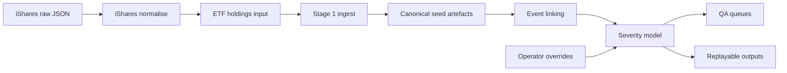
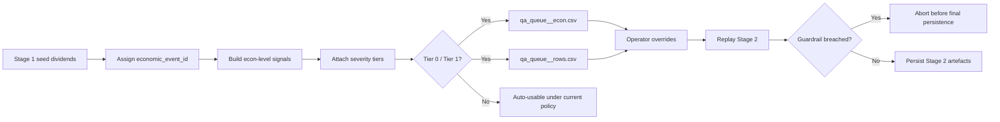
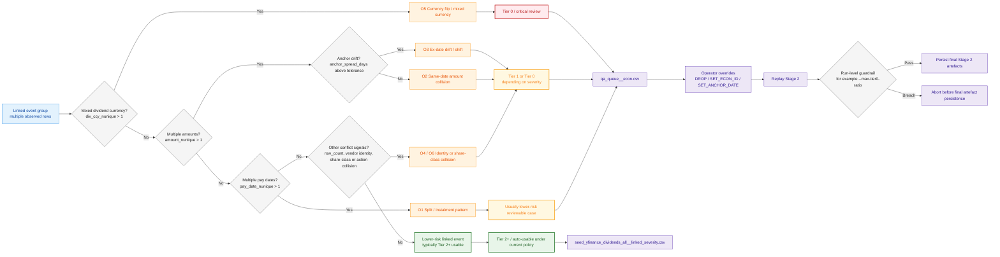

# Vendor-Agnostic Dividend Event Ingestion & QA Engine (`divpipe`)

`divpipe` is a dividend ingestion, review and QA engine for imperfect corporate action datasets.

It is designed as a vendor-agnostic pipeline, although the implemented v1 ingestion surface is currently centred on public-provider workflows using yfinance and deterministic iShares holdings JSON inputs.

The practical focus of v1 is Stage 0 and Stage 1 reliability:
- deterministic holdings normalisation
- reproducible provider-ingested seed artefacts
- explicit ticker-resolution review surfaces
- controlled hand-off into Stage 2 severity routing

Stage 2 exists to link, tier and route reviewable event ambiguity. It is intentionally not presented as a fully automated final-resolution engine.

## Pipeline overview



## Stage 2 routing overview



## Stage 2 decision logic map

The diagram below is a simplified view of how linked event groups are evaluated in Stage 2.

It is intended to show the main review signals and routing logic, not every implementation detail or threshold in the current policy.



## Key outputs

| Output | Purpose |
|---|---|
| `seed_yfinance_dividends_all.csv` | Canonical Stage 1 seed rows from provider-observed dividend events |
| `seed_yfinance_errors_all.csv` | Provider-level hard-failure surface for Stage 1 fetch and contract issues |
| `seed_yfinance_no_dividends_all.csv` | Stage 1 no-dividend triage surface covering genuine no-dividend windows, coverage-limited cases and venue-policy review paths |
| `seed_yfinance_discovered_candidates_all.csv` | Candidate-resolution audit surface used for ticker QA, venue ambiguity review and cache maintenance |
| `ticker_map_report.csv` | Main Stage 1 ticker-resolution outcome summary |
| `ticker_failed_queue.csv` | Direct Stage 1 queue for failed or untrusted ticker-resolution cases |
| `ticker_anomaly_queue.csv` | Secondary Stage 1 ticker QA surface for anomalous but non-hard-failure resolution outcomes |
| `ticker_resolution_review_queue.csv` | Review-priority Stage 1 queue for ambiguous or policy-sensitive ticker-resolution cases |
| `seed_yfinance_dividends_all__linked_severity.csv` | Row-level linked dataset with economic ids and severity tiers |
| `econ_severity_summary.csv` | Economic-event review surface |
| `qa_queue__econ.csv` / `qa_queue__rows.csv` | Operator review queues for Tier 0 and Tier 1 event ambiguity |
| `qa_queue__o3_pairs.csv` / `qa_queue__o3_econ.csv` | Optional O3 drift review surfaces when enabled by policy or diagnostics |
| `_meta/run_args.json` | Resolved runtime inputs, layout metadata and replay audit trail for the run |
| `_meta/stage1_summary.json` | Stage 1 per-tag metrics, failure summary and timing metadata |

---

## Non-goals

v1 does **not** aim to:
- fully auto-deduplicate all dividend events
- act as a golden-source corporate actions engine
- hide ambiguity behind aggressive heuristic clustering
- claim complete venue or provider coverage

The aim is not perfect sourcing. The aim is controlled, reviewable handling of imperfect observations.

---

## v1 emphasis

The centre of gravity in v1 is Stage 0 and Stage 1, not Stage 2.

The main implemented value is:
- deterministic holdings preparation from iShares raw JSON
- controlled Stage 1 ingestion into canonical seed artefacts
- explicit ticker-resolution QA surfaces
- reproducible downstream replay inputs

---

## Unsupported and venue-policy treatment

### Definition of unsupported

**Unsupported** means a venue, instrument pattern or provider surface outside the engine’s approved v1 automation boundary where dependable and repeatable ticker resolution or dividend retrieval cannot currently be assured.

Unsupported is a policy classification, not a statement that the security is invalid.

A case should not be marked unsupported merely because no dividend was observed in the requested window.

Likewise, a case should not be marked unsupported merely because more than one plausible candidate was observed. Where ambiguity can be reduced through deterministic venue precedence or tie-break policy, the preferred v1 treatment is to retain that case within the review surface rather than exclude it prematurely.

### Current venue-policy treatment

| Pattern | v1 treatment | Evidence status | Rationale |
|---|---|---|---|
| UAE | Venue-policy review | Policy present; currently treated conservatively with review visibility preserved | Current provider-side venue resolution is not dependable enough for repeatable automated handling across UAE aliases and exchange-specific mappings |
| Philippines (`.PS`) | Coverage-limited review | Observed | Ticker existence may be observable while dividend-history retrieval remains incomplete, unstable or absent under the current provider surface |
| Russia local listings | Unsupported boundary | Policy present | Dependable automated local-venue resolution and dividend retrieval cannot currently be assured within the present v1 policy boundary |
| NSE–BSE dual listing | Policy-resolved ambiguity | Observed | Better handled through deterministic market-preference rules than through blanket exclusion or unsupported treatment |

Evidence status is stated relative to the current implemented policy surface and the review artefacts observed in the current public run.

Practical interpretation in v1:

- **Unsupported boundary**
  - the current provider surface and policy boundary do not support dependable automated handling
- **Coverage-limited review**
  - the instrument may exist, but dividend retrieval is incomplete, unstable or absent within the requested window
- **Policy-resolved ambiguity**
  - more than one plausible market candidate exists, but the case is expected to be handled through deterministic precedence or tie-break policy rather than blanket exclusion
- **Genuine no-dividend window**
  - the instrument may be valid, but no dividend event is observed in the requested period

This distinction is deliberate. v1 is designed to separate unsupported automation boundaries from reviewable provider limitations and policy-resolvable market ambiguity.

Where provider coverage is structurally weak, the preferred v1 behaviour is to preserve review visibility rather than to overstate unsupported status or silently discard the case.

---

## Requirements

- Python 3.10+
- `pyproject.toml` at the repository root
- editable install via `python -m pip install -e .`

The examples below assume commands are run from the repository root.

---

## Quickstart

```bash
python -m pip uninstall -y divpipe-engine || true
python -m pip install -e .

mkdir -p data/raw/ishares

END_DATE="$(date +%Y%m%d)"

divpipe ishares download --etf EEM EFA --out data/raw/ishares
divpipe ishares normalise --etf EEM EFA

divpipe ingest \
  --holdings data/holdings_EEM.csv data/holdings_EFA.csv \
  --tags EEM EFA \
  --bgn 20260101 \
  --end "${END_DATE}"

divpipe severity \
  --qa-decisions data/overrides/qa_decisions.csv
```

Notes:
- `divpipe` is the official command surface.
- `mkdir -p data/raw/ishares` is shown for explicitness. The workflow should create required directories when possible, but creating the raw cache directory up front keeps the Quickstart unambiguous.
- `divpipe ishares normalise` reads raw iShares JSON snapshots and produces `data/holdings_<ETF>.csv` matching the Stage 1 holdings input contract.
- `data/holdings_<ETF>.csv` remains the Stage 1 holdings input contract.
- These examples assume a current as-of workflow using the latest downloaded iShares holdings snapshot, so `--end` should normally be set to the execution date.
- Stage 2 is offline-capable as long as Stage 1 seed artefacts already exist under the run root.
- `data/overrides/qa_decisions.csv` is local-only and should not be committed.
- Stage 1 requires explicit `--tags` by default.
- To permit filename-based tag inference, pass `--allow-tag-inference`.
- If `--regions` is omitted, Stage 1 will try to infer regions from registry metadata. For custom holdings not backed by registry metadata, pass `--regions` explicitly.
- Stage 2 supports an optional run-level guardrail via `--max-tier0-ratio` to fail runs that produce an unexpectedly high share of Tier 0 economic events.
- If `data/overrides/qa_decisions.csv` does not already exist, Stage 2 creates a template at that path and exits. Populate it, then re-run `divpipe severity`.

---

## Official workflow (v1)

Official command surface:
- `divpipe ingest`
- `divpipe severity`
- `divpipe ishares download`
- `divpipe ishares normalise`

Anything under `python -m ...` or `python scripts/...` is internal or dev-only.

### Stage 0) iShares holdings: raw JSON download -> normalise -> divpipe input

**File naming contract**
- Raw cache filename: `data/raw/ishares/<YYYYMMDD>_<ETF>.json`
- Raw audit versions: `data/raw_versions/ishares/<ETF>/<YYYYMMDD>/raw_<n>.json`
- Normalised outputs: `data/holdings_<ETF>.csv`

Download raw holdings:

```bash
mkdir -p data/raw/ishares
divpipe ishares download --etf EEM EFA --out data/raw/ishares
```

`divpipe ishares download` discovers the live iShares holdings JSON endpoint from the product HTML, verifies the fund as-of date from HTML metadata, then stores the raw JSON snapshot locally.

Normalise to divpipe holdings:

```bash
divpipe ishares normalise --etf EEM EFA
```

QC behaviour:
- fails if equity weights do not sum to ~1.0 within tolerance
- fails if parse-fail ratio or non-positive weight ratio breaches configured thresholds
- fails if required iShares JSON structure is missing or malformed

### Why the local mapping file was removed

Earlier versions used a manually maintained local mapping file to reattach identifiers such as ISIN, SEDOL and CUSIP to iShares holdings exports.

This is no longer required.

The current workflow downloads the live iShares holdings JSON payload directly, where those identifiers are already present in the raw source. The normaliser converts that JSON directly into the Stage 1 holdings input format.

As a result:
- no local `mapping.csv` is required for standard iShares workflows
- no manual identifier copy-paste step is required
- `data/holdings_<ETF>.csv` is still produced, but it is now a deterministic normalised artefact rather than a manually repaired file

### Stage 1) Ingest

Stage 1 always creates a new run root.

```bash
END_DATE="$(date +%Y%m%d)"

divpipe ingest \
  --holdings data/holdings_EEM.csv data/holdings_EFA.csv \
  --tags EEM EFA \
  --bgn 20260101 \
  --end "${END_DATE}"
```

These holdings files are generated by `divpipe ishares normalise`; they are no longer manually assembled from separate mapping files.

These examples assume a current as-of workflow using the latest downloaded iShares holdings snapshot, so `--end` should normally be set to the execution date.

A deliberate v1 safeguard is strict tag handling: Stage 1 requires explicit `--tags` by default and only permits filename-based inference when `--allow-tag-inference` is explicitly set.

Optional explicit tag and region control:

```bash
END_DATE="$(date +%Y%m%d)"

divpipe ingest \
  --holdings data/custom_a.csv data/custom_b.csv \
  --tags CUSTOM_A CUSTOM_B \
  --regions EM DM \
  --bgn 20260101 \
  --end "${END_DATE}"
```

Stage 1 writes:
- `seed_yfinance_dividends_all.csv`
- `seed_yfinance_errors_all.csv`
- `seed_yfinance_no_dividends_all.csv`
- `seed_yfinance_discovered_candidates_all.csv`
- `seed_input_rejections_all.csv`
- `ticker_map_report.csv`
- `ticker_failed_queue.csv`
- `ticker_anomaly_queue.csv`
- `ticker_resolution_review_queue.csv`
- `_meta/stage1_summary.json`

These artefacts make Stage 1 resolution outcomes directly reviewable before Stage 2 severity processing.

Stage 1 policy notes:
- if `--tags` is omitted, Stage 1 fails by default
- to allow filename-based tag inference, pass `--allow-tag-inference`
- if inference is enabled, holdings filenames must permit unambiguous tag inference
- if `--regions` is omitted, Stage 1 will try to infer regions from registry metadata. For custom holdings not backed by registry metadata, pass `--regions` explicitly
- by default, `output/runs/latest` is updated **only if all tags succeed**
- to publish latest even with partial failures, pass:

  ```bash
  END_DATE="$(date +%Y%m%d)"

  divpipe ingest \
    --holdings data/holdings_EEM.csv data/holdings_EFA.csv \
    --tags EEM EFA \
    --bgn 20260101 \
    --end "${END_DATE}" \
    --publish-latest-on-partial-failure
  ```

### Stage 2) Severity + QA queues

Default behaviour: resolve the run root from `output/runs/latest`.

```bash
divpipe severity \
  --qa-decisions data/overrides/qa_decisions.csv
```

Optional: respect pre-seeded economic ids

```bash
divpipe severity \
  --respect-existing-econ-id \
  --qa-decisions data/overrides/qa_decisions.csv
```

Optional: apply a run-level guardrail on Tier 0 concentration

```bash
divpipe severity \
  --qa-decisions data/overrides/qa_decisions.csv \
  --max-tier0-ratio 0.20
```

Stage 2 writes:
- `seed_yfinance_dividends_all__linked_severity.csv`
- `econ_severity_summary.csv`
- `qa_queue__econ.csv`
- `qa_queue__rows.csv`

Optional O3 review outputs:
- `qa_queue__o3_pairs.csv`
- `qa_queue__o3_econ.csv`

Stage 2 is designed as a reviewable severity-routing layer with optional run-level guardrails, not a fully automated final-resolution engine.

Current guardrail surface:
- `--max-tier0-ratio`
  - aborts Stage 2 before final artefact persistence if the Tier 0 economic-event ratio exceeds the supplied threshold
  - valid range: `0` to `1`
  - intended as a run-level fail-fast check when the review surface is too contaminated for automatic downstream use

---

## Offline demo

This demo skips Stage 1 network collection and replays Stage 2 from committed sample artefacts.

Required sample inputs:
- `data/sample/stage1_seed/seed_yfinance_dividends_all.csv`
- `data/sample/stage1_seed/seed_yfinance_errors_all.csv`
- `data/sample/stage1_seed/seed_yfinance_no_dividends_all.csv`
- `data/sample/overrides/qa_decisions_demo.csv`

### Demo command

```bash
RUN_ROOT="output/runs/divpipe__demo_offline"
mkdir -p "${RUN_ROOT}/stage1_seed"

cp -f data/sample/stage1_seed/seed_yfinance_dividends_all.csv      "${RUN_ROOT}/stage1_seed/"
cp -f data/sample/stage1_seed/seed_yfinance_errors_all.csv         "${RUN_ROOT}/stage1_seed/"
cp -f data/sample/stage1_seed/seed_yfinance_no_dividends_all.csv   "${RUN_ROOT}/stage1_seed/"

divpipe severity \
  --run-root "${RUN_ROOT}" \
  --qa-decisions data/sample/overrides/qa_decisions_demo.csv
```

### Expected outputs

```text
output/runs/divpipe__demo_offline/
  _meta/
  stage1_seed/
    seed_yfinance_dividends_all.csv
    seed_yfinance_errors_all.csv
    seed_yfinance_no_dividends_all.csv
  stage2_analysis/
    seed_yfinance_dividends_all__linked_severity.csv
    econ_severity_summary.csv
    qa_queue__econ.csv
    qa_queue__rows.csv
```

Sanity checks:

```bash
test -f "${RUN_ROOT}/stage2_analysis/econ_severity_summary.csv"
test -f "${RUN_ROOT}/stage2_analysis/qa_queue__econ.csv"
test -f "${RUN_ROOT}/stage2_analysis/qa_queue__rows.csv"
```

What this proves:
- Stage 2 can run offline from fixed Stage 1 seed artefacts
- Tier 0 and Tier 1 review surfaces are reproducibly emitted into QA queues
- operator overrides are applied consistently on replay

---

## Run directory layout

All run artefacts are produced under:
- `output/runs/<run_id>/`

Canonical run layout:

```text
output/runs/<run_id>/
  _meta/
    run_args.json
    stage1_summary.json
  stage1_seed/
    ...
  stage2_analysis/
    ...
```

A stable pointer is maintained:
- `output/runs/latest` -> most recent published run root
- `output/runs/latest.txt` may be used as a fallback pointer on platforms where symlink update is unavailable

Stage 2 run-root resolution rule:
1. prefer `output/runs/latest` if present
2. otherwise pick the newest `output/runs/divpipe__*` by mtime
3. always print the resolved `run_root`

Important operational rule:
- Stage 1 does **not** publish `latest` on partial failure by default
- this prevents downstream consumers from silently reading incomplete runs
- use `--publish-latest-on-partial-failure` only when that behaviour is intentionally desired

---

## Operational artefacts

Stage 1 intentionally preserves unresolved no-dividend and venue-policy cases as explicit reviewable artefacts rather than collapsing them into a single hard-failure bucket.

| File | Produced by | Purpose | How it is used |
|---|---|---|---|
| `seed_yfinance_dividends_all.csv` | Stage 1 | Canonical provider-ingested dividend rows | Stage 2 input and offline replay baseline |
| `seed_yfinance_errors_all.csv` | Stage 1 | Provider-level hard failures | Hard-failure review and error taxonomy |
| `seed_yfinance_no_dividends_all.csv` | Stage 1 | Tickers with no dividends observed in the requested window | Triage surface for genuine no-dividend windows, coverage-limited cases, venue-policy limitations and candidate ambiguity |
| `seed_yfinance_discovered_candidates_all.csv` | Stage 1 | Candidate-resolution audit surface for ticker discovery outcomes | Supports ticker QA, venue ambiguity review and cache or update workflows |
| `seed_input_rejections_all.csv` | Stage 1 | Input rows rejected before provider fetch | Records pre-ingest contract and data-quality rejections |
| `ticker_map_report.csv` | Stage 1 | Per-underlying ticker-resolution outcome summary | Main Stage 1 ticker QA surface |
| `ticker_failed_queue.csv` | Stage 1 | Failed ticker-resolution cases only | Direct operator review queue for unresolved names |
| `ticker_anomaly_queue.csv` | Stage 1 | Resolution anomalies that are not pure hard failures | Secondary ticker QA surface |
| `ticker_resolution_review_queue.csv` | Stage 1 | Review-priority subset requiring manual resolution attention | Focused operator queue for ambiguous or policy-sensitive cases |
| `seed_yfinance_dividends_all__linked_severity.csv` | Stage 2 | Row-level data with `economic_event_id` and `severity_tier` | Primary linked row dataset |
| `econ_severity_summary.csv` | Stage 2 | Economic-event severity summary | Main review surface |
| `qa_queue__econ.csv` | Stage 2 | Tier 0 and Tier 1 economic events | Operator work queue |
| `qa_queue__rows.csv` | Stage 2 | Evidence rows for Tier 0 and Tier 1 economic events | Manual review support |
| `_meta/run_args.json` | Stage 1 | Resolved runtime inputs and layout metadata | Audit trail for run configuration |
| `_meta/stage1_summary.json` | Stage 1 | Per-tag outcomes, failures, counts and timing metrics | Operational summary and debugging surface |

### Note on `seed_yfinance_no_dividends_all.csv`

This is a diagnostic artefact, not automatically an error file.

Typical cases include:
- genuine no-dividend windows
- coverage-limited provider cases
- venue-policy limitations
- candidate-selection ambiguity
- cases falling outside the current v1 support boundary

Use `exists_ticker` first, then triage using `candidates`, `candidate_count` and any available cross-checks.

This artefact should therefore be treated as a triage surface rather than a pure failure bucket.

Typical Stage 1 bucketed derivatives of `seed_yfinance_no_dividends_all.csv` may include:
- `seed_yfinance_no_dividends_all__kr.csv`
- `seed_yfinance_no_dividends_all__rest.csv`
- `seed_yfinance_no_dividends_all__rest__suspect_mapping.csv`
- `seed_yfinance_no_dividends_all__unsupported.csv`

### Note on `ticker_failed_queue.csv` vs `ticker_resolution_review_queue.csv`

- `ticker_failed_queue.csv`
  - direct hard-failure ticker-resolution cases only
- `ticker_resolution_review_queue.csv`
  - broader review-priority surface, including failed resolution and policy-sensitive ambiguity

The two files may overlap heavily in some runs, but they encode different operator intents.

### Note on `stage1_summary.json`

`_meta/stage1_summary.json` records:
- resolved tags and regions
- failed tag count and successful tag count
- per-tag metrics under `tag_metrics`
- per-tag timing fields:
  - `started_at`
  - `finished_at`
  - `elapsed_seconds`
- aggregate timing fields:
  - `total_elapsed_seconds`
  - `max_tag_elapsed_seconds`
  - `mean_tag_elapsed_seconds`

This file is intended as a first-pass operational audit surface for Stage 1.

---

## Overlap patterns (O1–O6)

Overlap means multiple vendor rows might represent the same economic cashflow event, or might represent distinct events.

v1 does not auto-resolve overlap. It detects it, tiers it and routes it into QA.

### O1 — Split / instalments
- same underlying, same ex-date, multiple pay-dates
- usually low risk
- typically no action required

### O2 — Same-date amount collision
- same underlying, same ex-date, same pay-date, different amount
- usually Tier 1
- typically requires explicit operator review

### O3 — Ex-date drift / shift
- similar amount or currency and often similar pay-date, but ex-date differs by a small window
- usually Tier 1, sometimes Tier 0
- typical action: set anchor date, set economic id or drop

### O4 — Vendor identity conflict
- same `vendor_event_id` implies conflicting identity
- fail-fast condition
- requires upstream fix and re-run

### O5 — Currency flip / mixed currency representation
- same underlying and nearby dates, but different dividend currencies
- usually Tier 0
- often requires dropping the non-canonical row

### O6 — Share-class / action collision
- similar dates or amounts across related tickers or action types
- typically Tier 1, sometimes Tier 0
- review depends on intended economic identity

---

## Severity model

Naive clustering causes silent loss or double-counting.  
Tiering forces review only where clustering risk is materially high.

Tier meaning:
- **Tier 0 / Tier 1**: do not auto-use; review required
- **Tier 2+**: auto-usable under current policy

Typical economic-event signals:
- `row_count`
- `amount_nunique`
- `anchor_spread_days`
- `pay_date_nunique`
- `div_ccy_nunique`
- `vendor_event_id_nunique`

---

## QA decisions

Recommended local path:
- `data/overrides/qa_decisions.csv`

### Required columns
- `vendor_event_id`
- `underlying`
- `ex_date`
- `action`

### Optional columns
- `amount`
- `div_ccy`
- `economic_event_id`
- `anchor_date`
- `note`

### Valid actions
- `DROP`
- `SET_ECON_ID`
- `SET_ANCHOR_DATE`

Apply decisions by re-running Stage 2:

```bash
divpipe severity --qa-decisions data/overrides/qa_decisions.csv
```

Template behaviour:
- if `--qa-decisions <path>` does not already exist, Stage 2 creates a template CSV at that path and exits
- fill it, then re-run Stage 2

---

## Artefact schema contract

Each CSV output is treated as an artefact with a strict required-columns contract.  
The test suite enforces this via `tests/test_schema_contract.py`.

### Inputs

| Artefact | Path | Required columns | Notes |
|---|---|---|---|
| Holdings input | `data/holdings*.csv` | `underlying`, `weight`, `underlying_ccy` | Produced by `divpipe ishares normalise` from raw iShares JSON; optional extras may exist |

### Stage 1

| Artefact | Path | Required columns | Notes |
|---|---|---|---|
| Seed dividends | `stage1_seed/seed_yfinance_dividends_all.csv` | `source`, `source_event_key`, `underlying`, `isin`, `market`, `currency`, `action_type`, `status`, `ex_date`, `amount`, `amount_type`, `amount_ccy`, `confidence`, `evidence_json`, `asof_date`, `ingest_ts` | `pay_date` may be blank |
| Seed errors | `stage1_seed/seed_yfinance_errors_all.csv` | `source`, `underlying`, `underlying_ccy`, `isin`, `error`, `candidates`, `start`, `end` | Additional fields may exist |
| Seed no-dividends | `stage1_seed/seed_yfinance_no_dividends_all.csv` | `source`, `underlying`, `underlying_ccy`, `isin`, `status`, `exists_ticker`, `candidates`, `start`, `end` | Diagnostic output |
| Discovered candidates | `stage1_seed/seed_yfinance_discovered_candidates_all.csv` | `source`, `underlying`, `underlying_ccy`, `isin`, `chosen_ticker`, `candidate_market`, `candidate_origin`, `resolution_status`, `resolution_reason`, `resolution_method`, `resolution_source`, `candidate_count`, `candidates_json`, `exists_ticker`, `exists_ns`, `exists_bo`, `start`, `end` | Used for ticker QA, review queues and cache maintenance |
| Input rejections | `stage1_seed/seed_input_rejections_all.csv` | `source`, `underlying_raw`, `underlying_normalised`, `underlying_ccy`, `isin`, `reason`, `holdings_tag`, `holdings_file` | Records rows excluded before provider fetch |

### Stage 2

| Artefact | Path | Required columns | Notes |
|---|---|---|---|
| Linked + severity rows | `stage2_analysis/seed_yfinance_dividends_all__linked_severity.csv` | `economic_event_id`, `event_link_reason`, `severity_tier` | Full row-level output |
| Economic event severity summary | `stage2_analysis/econ_severity_summary.csv` | `economic_event_id`, `severity_tier`, `row_count`, `amount_nunique`, `anchor_spread_days` | One row per economic event |
| QA queue (econ) | `stage2_analysis/qa_queue__econ.csv` | `economic_event_id`, `severity_tier`, `row_count` | Tier 0 and Tier 1 only |
| QA queue (rows) | `stage2_analysis/qa_queue__rows.csv` | `economic_event_id`, `severity_tier` | Evidence rows for flagged economic ids |
| Fixture debug (case tags) | `stage2_analysis/fixture_debug__case_tag_severity.csv` | `case_tag`, `economic_event_id`, `severity_tier` | Present only if `case_tag` exists |
| Fixture debug (O3 pairs) | `stage2_analysis/fixture_debug__o3_within_run_pairs.csv` | `underlying`, `econ_id_a`, `econ_id_b`, `ex_date_abs_shift_days`, `amount_abs_diff` | Diagnostic surface |
| Rows (Brazil) | `stage2_analysis/rows__brazil.csv` | `economic_event_id`, `severity_tier` | Region split |
| Rows (Non-Brazil) | `stage2_analysis/rows__non_brazil.csv` | `economic_event_id`, `severity_tier` | Region split |
| Rows (Korea) | `stage2_analysis/rows__korea.csv` | `economic_event_id`, `severity_tier` | Region split |
| No-div (Brazil) | `stage2_analysis/no_div__brazil.csv` | `source`, `underlying`, `underlying_ccy`, `status` | Split from Stage 1 no-div file |
| No-div (Korea) | `stage2_analysis/no_div__korea.csv` | `source`, `underlying`, `underlying_ccy`, `status` | Split from Stage 1 no-div file |

### Optional Stage 2 (O3 review outputs)

| Artefact | Path | Required columns | Notes |
|---|---|---|---|
| QA queue (O3 pairs) | `stage2_analysis/qa_queue__o3_pairs.csv` | `underlying`, `econ_id_a`, `econ_id_b`, `ex_date_abs_shift_days`, `amount_abs_diff` | O3 drift review surface |
| QA queue (O3 econ) | `stage2_analysis/qa_queue__o3_econ.csv` | `economic_event_id`, `severity_tier`, `row_count` | Small economic summary for reviewed pairs |

---

## Packaging / CLI recovery

```bash
chmod +x scripts/cleanup_editable.sh scripts/divpipe_sanity.sh

# use only when editable metadata is corrupted
./scripts/cleanup_editable.sh

# use when debugging or before sharing the repo
./scripts/divpipe_sanity.sh

# optional: enable live ingest smoke with explicit date window
END_DATE="$(date +%Y%m%d)"
RUN_INGEST_SMOKE=1 BGN=20260101 END="${END_DATE}" ./scripts/divpipe_sanity.sh
```

---

## What to commit and what not to commit

The repository is private-by-default for data surfaces. Only explicitly allowlisted sample and config artefacts should be committed.

### Commit
- `src/`
- `scripts/`
- `tests/`
- `README.md`
- `pyproject.toml`

**Allowlisted data only**
- `data/sample/**`
- `data/overrides/*template*.csv`
- `data/overrides/*sample*.csv`
- `data/overrides/*demo*.csv`
- `data/config/exchange_map.csv`
- `data/ccy_suffix_map.csv`

### Do not commit
- `output/**`
- `data/_cache/**`
- `data/raw/**`
- `data/raw_versions/**`
- `data/holdings/archive/**`
- `data/holdings/latest_versions/**`
- `.env`, `*.env`, `.env.*`
- `*.xlsx`

Always keep local-only:
- `data/overrides/qa_decisions.csv`
- `data/chosen_ticker_map.csv`

Suggested `.gitignore`:

```gitignore
# secrets
.env
*.env
.env.*

# python
__pycache__/
*.py[cod]
*$py.class
venv/
.venv/
env/

# outputs & caches
output/
data/_cache/

# data (private by default)
data/*

# allow public sample/config data
!data/sample/
!data/sample/**
!data/config/
!data/config/exchange_map.csv
!data/ccy_suffix_map.csv

# overrides: keep only template/sample/demo
!data/overrides/
data/overrides/*
!data/overrides/*template*.csv
!data/overrides/*sample*.csv
!data/overrides/*demo*.csv
data/overrides/qa_decisions.csv

# private modules
src/engine/krdiv/
src/engine/legacy/

# private legacy scripts
scripts/legacy/

# local-only tests
tests_krdiv/

# local ticker maps
data/chosen_ticker_map.csv
data/mapping.csv
data/chosen_ticker_map.csv.bak
data/chosen_ticker_map.csv.bak2

# ad-hoc overlap samples
bbg_overlap_samples__*.csv

# raw/versioned/private data
data/raw/
data/raw_versions/
data/holdings/archive/
data/holdings/latest_versions/

# timestamped bak files
*.bak_*
*.bak

# local artifacts
*.xlsx
~$*.xlsx

# OS
.DS_Store
Thumbs.db

# IDE
.idea/

# packaging
dist/
build/
*.egg-info/
**/*.egg-info/

# caches
.pytest_cache/
.mypy_cache/
.ruff_cache/
.tmp/
```

This keeps the public repository reproducible without leaking local operational state, raw provider pulls or operator decision files.

---

## Internal / dev-only entrypoints

These are retained for direct debugging and development only.  
The public command surface is `divpipe`.

```bash
python -m engine.divpipe.run_pipeline ...
python -m engine.divpipe.check_severity ...
python -m providers.ishares_provider ...
python -m providers.ishares_normaliser ...
python scripts/gen_synthetic_rows_fixture.py ...
```

---

## v2 direction

v2 is intended to move `divpipe` from a careful CSV-based review tool towards a more durable event-processing system.

The architectural transition is from a largely stateless CSV-first replay model towards a stateful event-store model with explicit persistence of observations, linkage state, overrides and replay history.

Priority changes:

- **Replace CSV-first intermediate state with SQLite**
  - move Stage 1 and Stage 2 intermediate state into a SQLite-backed event store
  - persist raw observations, linked economic events, override decisions and replay history in one place
  - keep CSVs as export surfaces, not as the primary operational state layer

- **Reduce manual QA through controlled auto-clustering**
  - introduce explicit clustering logic for likely duplicate or overlapping observations
  - use deterministic, reviewable linkage rules rather than ad hoc operator-only resolution
  - retain fail-safe review queues for genuinely ambiguous cases, but reduce avoidable manual triage

- **Focus validation on dividend-event integrity**
  - prioritise statistical and structural checks on dividend observations themselves
  - add validation for amount stability, date drift, currency consistency, repeated-event patterns and outlier behaviour

Planned v2 workstreams:
- SQLite-backed event store
- deterministic clustering layer
- dividend-specific validation
- market-specific hardening for Korea, Brazil and other materially relevant markets

The practical aim is to replace manual CSV-driven review with a durable event store and controlled automatic resolution.

---

## Disclaimer

No proprietary vendor data is included. Outputs are either synthetic or generated via public endpoints for demonstration of engineering and operational controls only.

---

## Notice

This repository and any accompanying materials are made available strictly for review and portfolio purposes only. No licence, right or permission is granted, whether express, implied, by conduct or otherwise, to copy, reproduce, circulate, forward, distribute, submit, adapt, use or rely upon any part of this repository or its contents for any external, commercial, recruitment, evaluative or other third-party purpose without the author's prior written consent in each particular instance.

For the avoidance of doubt, this notice applies with immediate effect to any continued possession, circulation, forwarding, submission, review, copying, reproduction, distribution or other use of this repository or its contents following publication of this notice. Any such continued or further use is unauthorised unless and until expressly authorised in writing by the author.

Nothing in this notice shall be taken as a waiver of any rights or remedies arising from any prior unauthorised use.

© 2026 Dawoon Na. All rights reserved.

---

## Contact

Dawoon Na  
nadawoon@icloud.com
